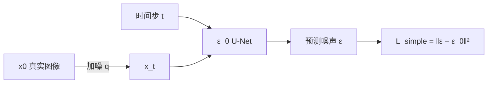

# Paper Logic Reading（精读论文 · 三栏批注）

将学术论文制作成**单个三栏批注 HTML 文件**，逐段呈现：**原文 | 中文翻译 | 解析**。

## 触发场景

- 用户说「精读论文」「逻辑分析」「三栏批注 HTML」
- 用户提供 arXiv / PDF 链接，或 README 表格中的论文行
- 用户引用 Prompt B / 纯逻辑分析版

## 三栏布局

| 栏 | 类名 | 内容 |
|----|------|------|
| 左 | `.col-original` | 论文原文，五类维度高亮，Lora 衬线字体 |
| 中 | `.col-translation` | 该段忠实中文翻译，不混入解析 |
| 右 | `.col-analysis` | 段落功能、逻辑角色、论证技巧或潜在漏洞 |

每段用 `.row` 包裹上述三栏，**逐段一一对应**。

## 工作流

```
Task Progress:
- [ ] 1. 获取论文全文
- [ ] 2. 规划章节取舍与粒度
- [ ] 3. 分段：原文高亮 + 中文翻译 + 解析（标注出处）
- [ ] 4. 核心方法 / 实验章节深度解析（含逻辑图）
- [ ] 5. 三步精读模块：费曼速读 + 结构化十问 + 深挖追问
- [ ] 6. 生成 HTML 并写入 paper-reading/
- [ ] 7. 校验输出
```

## 保真性铁律（最高优先级，贯穿全程）

精读工具的价值在于**可信**。以下规则高于一切风格要求：

1. **只用论文支持的信息**。论文未给出的内容（数字、设置、结论），一律写「**论文未说明**」，**严禁编造或推测填充**——尤其是实验表格里的指标、学习率、步数、数据规模。
2. **关键论断与每个实验数字标注出处**：`§节号` / `式(N)` / `Table N` / `Fig N` / `p.页`。便于读者回查。
3. **不确定时降级为定性描述**，不杜撰精确值（如写「论文称显著提升」而非编一个数）。
4. **翻译忠实**，不增删原意；解析与翻译分栏，评价只进解析栏。

> 宁可在解析里写「论文未说明该超参」，也不要猜一个看似合理的数字。幻觉数字比留白更有害。

## 章节取舍与粒度

长论文逐字逐段会产出超大文件且淹没论证主线。按下表取舍：

| 处理 | 章节 |
|------|------|
| **必精读**（三栏逐段） | Abstract、Introduction（论点/贡献）、核心 Method、Experiments（主结果 + 消融）、Conclusion |
| **可压缩**（合并为概述段） | Related Work、标准背景推导、冗长的预备知识 |
| **可跳过** | 致谢、参考文献、纯格式化附录（**除非**附录含关键实验细节，则提取进实验节） |

**分段粒度**：以「**论证单元**」为准，而非逐句。琐碎过渡句并入相邻段；冗长数学证明用「摘要 + 指向原文式号」代替全文搬运。目标是**还原论证链**，不是逐字翻译全文。

### Step 1: 获取论文全文

**来源优先级：**

1. 用户提供的 PDF 路径
2. arXiv 链接（README 中多为 `abs` 链接）
3. 用户粘贴的全文

**arXiv URL 转换（必读）：**

| 用途 | 格式 |
|------|------|
| 页面 / README 链接 | `https://arxiv.org/abs/YYMM.NNNNN` |
| **下载 PDF** | `https://arxiv.org/pdf/YYMM.NNNNN.pdf` |
| LaTeX 源码 | `https://arxiv.org/e-print/YYMM.NNNNN` |

> `.../abs/...` 是摘要页，不是 PDF。精读时必须将 `abs` 改为 `pdf` 再下载，或使用 `e-print` 获取 LaTeX 源码。

**读取方式：**

- PDF：优先 `pdftoppm` 转图后逐页阅读（公式/图表更准确）；或下载到 `.cache/{slug}/`
- arXiv 源码：解压到 `.cache/{slug}/`，从 `main.tex` 或入口文件读取

### Step 2: 分段处理

对**每个自然段**依次完成三栏内容：

1. **原文（左栏）**：保留分段；按五类维度高亮关键内容
2. **翻译（中栏）**：忠实、流畅的中文译文；术语首次出现可保留英文括号；公式/符号保持原样

> **公式一律用真 LaTeX**：行内 `$...$`、行间 `$$...$$`，由 KaTeX 渲染（见「HTML 实现要点」）。不要再用 `<sub>/<sup>` + Unicode 手工降级（如 `√ᾱ_t`），那样易错且难读。原文、翻译、解析三栏都适用。
3. **解析（右栏）**：
   - 段落功能（如：引出问题 / 提供证据 / 反驳异议 / 总结）
   - 逻辑角色（该段在整体论证链中的位置）
   - 值得注意的论证技巧或潜在漏洞

**五类高亮维度（仅用于左栏原文）：**

| 颜色 | 含义 |
|------|------|
| 黄色 | 核心论点 / thesis |
| 红色 | 关键概念 / 术语 |
| 蓝色 | 实证证据 / 数据 |
| 绿色 | 让步 / 反驳处理 |
| 紫色 | 方法论说明 |

**翻译栏要求：**

- 不添加原文没有的信息，不做评价
- 与左栏段落一一对应，不合并、不拆段
- 高亮语义可在译文中自然体现，但**不使用** `.hl-*` 类（高亮仅左栏）

### Step 2b: 重点章节深度解析（核心方法 / 实验）

普通段落的解析保持「段落功能 + 逻辑角色 + 论证技巧/漏洞」三项即可。但**核心方法**与**实验**两类章节，解析需显著加厚，并尽量配逻辑图。用 `.analysis-card.deep` 承载，内部用 `.analysis-detail` 分块。

#### A. 核心方法章节 —— 解析必须包含

| 字段 | 要求 |
|------|------|
| **方法动机** | 为何需要该设计？解决前文哪个具体痛点 |
| **公式/组件拆解** | 逐符号解释关键公式（输入、输出、各项含义）；列出主要模块 |
| **数据流 / 算法流程** | 从输入 → 中间表示 → 输出的完整路径；**必须配一张流程图**（见「逻辑图」节）：训练流程与推理/采样流程分别画 |
| **设计取舍** | 与替代方案对比（如本文 ε-预测 vs 直接预测均值），说明为何如此选 |
| **论证技巧 / 漏洞** | 该方法的论证是否闭环、是否有未证明的假设 |

> 方法流程图建议同时给出**训练阶段**与**推理/采样阶段**两张，或合并为一张带分支的图。

#### B. 实验章节 —— 解析必须包含「实验细节」结构化块

用 `.exp-detail` 列表 + `.exp-table` 表格呈现，至少覆盖：

| 维度 | 需说明的内容 |
|------|--------------|
| **数据集** | 名称、规模、分辨率；**训练 / 验证 / 测试划分**；预处理（归一化、裁剪等） |
| **训练 Loss** | 目标函数形式（写出公式）、各项含义、与方法节 loss 的对应关系 |
| **训练策略** | 优化器、学习率与调度、batch size、训练步数/epoch、EMA、正则、硬件与时长（论文未给则标注「未说明」） |
| **评价指标** | 每个指标的定义与方向（↑越大越好 / ↓越小越好），如 FID↓、IS↑、NLL↓ |
| **指标对比** | 用表格列出本文 vs 关键 baseline 的数字；标注 SOTA 项；点明对比是否公平（同数据集/同协议） |
| **消融实验** | 哪个组件被移除/替换，对应指标变化，得出的结论 |
| **论点↔证据映射** | 明确本节哪个结果支撑 Introduction 的哪条主张（可追溯，避免「堆数字不回应论点」） |
| **统计严谨性** | 是否多次运行 / 报告误差棒或方差；指标差异是显著还是仅小幅；论文未报告则写「论文未说明」 |
| **指标局限** | 所用指标（如 FID/IS）的已知缺陷、对比协议是否一致（训练集 vs 测试集、采样数等） |
| **结论与局限** | 实验支持了哪条主张；哪些结论证据偏弱（如仅定性、仅单数据集） |

> 指标对比表用 `.exp-table`：表头 `模型 | 指标A | 指标B | 说明`，本文行加 `<strong>` 或高亮。**数据须忠于论文，缺失项写「—」，严禁编造；每个数字应可回查到原文 Table/Fig**。

### Step 2c: 逻辑图与示意图

核心方法、实验 pipeline、全文论证骨架建议配图。两种来源，按需选用：

**1. 论文原图（优先用于复杂架构/定性结果）**

- 提取：`pdfimages -png .cache/{slug}/paper.pdf .cache/{slug}/fig`，或从 arXiv 源码 `images/` 目录复制
- 存放：复制到 `paper-reading/assets/{slug}/`，用相对路径 ``
- 必须标注**图号与出处**（如「图 2，原文 p.4」），不得裁剪歪曲原意

**2. 自绘流程图（优先用于训练/采样数据流、论证链）**

优先**内联 SVG**（完全自包含、离线可用）。流程较复杂时可用 **Mermaid**：在 `<head>` 引入一次 CDN

```html
<script src="https://cdn.jsdelivr.net/npm/mermaid@11/dist/mermaid.min.js"></script>
<script>mermaid.initialize({ startOnLoad: true, theme: 'neutral' });</script>
```

流程图示例（训练 vs 采样）：



**放置位置：**

- 单段配图：放入该段 `.col-analysis` 的 `.analysis-card` 内，用 `.diagram` 包裹
- 跨栏大图：用独立 `.figure-row`（占满三栏宽度），含 `<figure>` + `<figcaption>`

**配图原则：** 图服务于解析论点；每张图须有一句话说明它支撑哪条逻辑。

### Step 2d: 三步精读模块（费曼速读 / 结构化十问 / 深挖追问）

逐段三栏只完成了「双语扫读 + 逐段解析」。在此之上，再补三个**论文级**（非逐段）模块，让单文件形成「先建立骨架 → 精读正文 → 深挖闭环」的完整精读路径。三块均**遵守保真性铁律**（据论文回答，缺失写「论文未说明」，关键处标出处）。

**① 费曼速读（顶部，Abstract 之前）** —— `<section class="feynman" id="feynman">`

- 一段 ~300 字**大白话** TL;DR：核心思想 + **一个生活/游戏类比** + 点出 2–4 个核心概念
- 目的：读者在读正文前先建立模糊认知
- 公式可少量用 KaTeX；语言通俗优先，不堆术语

**② 结构化十问（底部）** —— `<section class="summary faq" id="faq">`

用原生 `<details>` 折叠逐条作答（第一问可 `open`），固定十问：

| # | 问题 |
|---|------|
| Q1 | 论文试图解决什么问题？ |
| Q2 | 这是否是一个新问题？ |
| Q3 | 要验证什么科学假设？ |
| Q4 | 有哪些相关研究？如何归类？领域内值得关注的研究者？ |
| Q5 | 解决方案的关键是什么？ |
| Q6 | 实验是如何设计的？ |
| Q7 | 用什么数据集评估？代码是否开源（给链接）？ |
| Q8 | 实验结果是否很好支持了假设？ |
| Q9 | 这篇论文到底有什么贡献？ |
| Q10 | 下一步可以做什么？（区分「作者展望」与「本文补充」） |

**③ 深挖追问（底部，十问之后）** —— `<section class="summary deepdive" id="deepdive">`

- **第一性原理**三块（各一个 `.block`）：**本质** / **哲学基础** / **数学基础**
- **批判性盲区**一块（`.block.crit`，红色）：回顾全文「**还有哪些没问的根本性问题/限制/盲区**」，列 4–6 条（如效率、假设最优性、泛化、对比公平性、可复现等）

**导航与放置：** 章节导航加 `速读 / 十问 / 深挖` 锚点；费曼在 `<main>` 顶部，十问与深挖在底部「论证结构总览」之后。

### Step 3: 输出路径与命名

**目录（固定）：** 仓库根目录 `paper-reading/`

**文件名：** `{slug}.html`，`slug` 为小写连字符，取自论文简称或标题关键词。

示例（README Diffusion Model 第 64 行 DDPM）：

| 字段 | 值 |
|------|-----|
| Title | DDPM |
| 全称 | Denoising Diffusion Probabilistic Models |
| abs | `https://arxiv.org/abs/2006.11239` |
| **pdf** | `https://arxiv.org/pdf/2006.11239.pdf` |
| 输出 | `paper-reading/ddpm.html` |

### Step 4: 校验

- [ ] 单个自包含 `.html`（图片放 `paper-reading/assets/{slug}/`）；除 Google Fonts 外仅允许 KaTeX 与 Mermaid 两个 CDN，否则用内联 SVG
- [ ] 公式用真 LaTeX `$...$` / `$$...$$`，KaTeX 正常渲染（无未转义的裸 `_`、`^`）
- [ ] 关键论断、实验数字标注出处（§/式/Table/Fig/p.）；论文未给出的写「论文未说明」，无编造
- [ ] 顶部导航含标题（**超链接到论文地址**）、课程信息（若用户提供）、五色图例
- [ ] sticky 章节导航可跳转
- [ ] 每段三栏对齐：原文 + 翻译 + 解析
- [ ] **核心方法**章节解析含：动机 / 公式拆解 / 数据流 / 设计取舍，并配训练+推理流程图
- [ ] **实验**章节解析含「实验细节」块：数据集（含划分）/ 训练 loss / 训练策略 / 指标定义 / 指标对比表 / 消融 / 局限
- [ ] 配图均标注出处或说明其支撑的逻辑
- [ ] 底部含论证结构总览（骨架 / 一句话主张 / 最强处 vs 最弱处）
- [ ] 顶部含**费曼速读**卡（~300字大白话 + 类比 + 核心概念）
- [ ] 底部含**结构化十问**（`<details>` 折叠 Q1–Q10）与**深挖追问**（第一性原理 ×3 + 批判盲区）
- [ ] 移动端 `@media` 单栏堆叠（原文 → 翻译 → 解析）
- [ ] 浏览器可直接打开

## Prompt B（无 Question，纯逻辑分析版 · 三栏）

请将以下学术论文制作成一个完整的三栏批注 HTML 文件，重点呈现论文的论证结构与逻辑层次。

**[保真性铁律]**
- 只用论文支持的信息；论文未给出的（数字、设置、结论）写「论文未说明」，严禁编造
- 关键论断与每个实验数字标注出处（§节/式(N)/Table N/Fig N/p.页）
- 公式一律用真 LaTeX：行内 `$...$`、行间 `$$...$$`（由 KaTeX 渲染），勿用 Unicode 降级

**[文件要求]**
输出单个 .html 文件，包含以下结构：
1. **顶部导航栏**
   - 标题: 论文名（**超链接到论文地址**，优先 arXiv abs 页或官方 PDF，新标签页打开）+ 课程信息
   - 颜色图例，对应以下分析维度：
     - 黄色 = 核心论点 / thesis
     - 红色 = 关键概念 / 术语
     - 蓝色 = 实证证据 / 数据
     - 绿色 = 让步 / 反驳处理
     - 紫色 = 方法论说明
2. **章节导航条 (sticky, 可跳转各节；含「速读 / 十问 / 深挖」锚点)**
3. **费曼速读卡 (顶部, Abstract 之前)**: ~300 字大白话 TL;DR + 一个生活/游戏类比 + 点出核心概念
4. **主体内容: 三栏布局 [原文 | 翻译 | 解析]**
   - **左栏: 论文原文**
     - 按上述五类维度高亮标注关键内容
     - 保留原文分段, Lora 衬线字体
   - **中栏: 中文翻译 (逐段对应)**
     - 忠实翻译左栏段落，不混入解析或评价
     - IBM Plex Sans，与原文段落一一对应
   - **右栏: 解析 (逐段对应)**
     - 每段解析包含:
       1. 段落功能 (如: 引出问题 / 提供证据 / 反驳异议 / 总结)
       2. 逻辑角色 (该段在整体论证链中的位置)
       3. 值得注意的论证技巧或潜在漏洞
     - **核心方法章节**额外包含: 方法动机 / 公式拆解 / 数据流（配训练+推理流程图）/ 设计取舍
     - **实验章节**额外包含「实验细节」: 数据集(训练/验证/测试划分) / 训练 loss / 训练策略(优化器·lr·batch·步数·EMA·硬件) / 指标定义 / 本文 vs baseline 指标对比表 / 消融 / 论点↔证据映射 / 统计严谨性(误差棒·显著性) / 指标局限 / 结论与局限
5. **逻辑图**: 复杂方法/实验流程配图——论文原图(标注出处)或自绘流程图(内联 SVG 或 Mermaid)
6. **符号速查表(可选)**: 符号密集论文在顶部或底部汇总「符号 → 含义」，符号用 LaTeX，与论文定义一致
7. **底部论证结构总览**
   - 全文逻辑骨架 (问题 > 论点 > 证据 > 反驳 > 结论)
   - 作者核心主张一句话版本
   - 论证最强处 vs 最弱处各一条
8. **结构化十问 (底部)**: `<details>` 折叠 Q1–Q10（解决问题/是否新问题/科学假设/相关研究与研究者/方案关键/实验设计/数据集与开源/结果是否支持假设/贡献/下一步）
9. **深挖追问 (底部)**: 第一性原理（本质 / 哲学基础 / 数学基础）+ 批判性盲区（回顾全文「还有哪些根本问题没问」4–6 条）

**[设计风格]**
- 深海军蓝导航栏 + 米白纸张底色 + 五类维度分色高亮
- 字体: 原文 Lora, 翻译与界面 IBM Plex Sans
- 解析卡片: 左色边 + 浅背景, 响应式 (移动端单栏堆叠)
- 三栏等宽或原文略宽 (`1.1fr 1fr 1fr`)

**[论文信息]**
- 标题: [填写]
- 课程 / 周次: [填写]

**[论文原文]**
- [粘贴全文]

## HTML 实现要点

结构骨架见 [template.html](template.html)。生成时：

- **数学公式（KaTeX）**：`<head>` 引入一次 CDN，并在末尾 auto-render：

```html
<link rel="stylesheet" href="https://cdn.jsdelivr.net/npm/katex@0.16/dist/katex.min.css">
<script defer src="https://cdn.jsdelivr.net/npm/katex@0.16/dist/katex.min.js"></script>
<script defer src="https://cdn.jsdelivr.net/npm/katex@0.16/dist/contrib/auto-render.min.js"
  onload="renderMathInElement(document.body,{delimiters:[{left:'$$',right:'$$',display:true},{left:'$',right:'$',display:false}]});"></script>
```

- CSS 变量定义五色高亮与海军蓝 `#1a2744`、纸色 `#faf8f5`
- **顶部整体固定**：把 `.top-nav` 与 `.chapter-nav` 一起包进 `<div class="sticky-head">`，对 `.sticky-head` 设 `position: sticky; top: 0; z-index: 100`（两栏作为整体固定顶部）；锚点偏移用脚本动态设置 `document.documentElement.style.scrollPaddingTop = stickyHead.offsetHeight + 'px'`（头部高度随图例换行变化），并在 `load`/`resize` 时刷新；移动端不要关闭 sticky
- 顶部 `h1` 标题包一层 `<a href="{论文地址}" target="_blank" rel="noopener">`，链接色白、带下划线提示
- 每段 `.row` 使用 `grid-template-columns: 1.1fr 1fr 1fr`
- 三栏类名：`.col-original`、`.col-translation`、`.col-analysis`
- 高亮用 `<span class="hl-thesis">` 等 class，仅左栏使用
- 中栏段落用 `.col-translation p`，不加高亮 span
- 右栏 `.analysis-card` 左侧 `border-left: 4px solid` 按段落主功能着色
- 可选：每节首行加 `.col-header` 显示「原文 | 翻译 | 解析」

**深度解析相关类：**

- `.analysis-card.deep`：加厚解析卡片；内部用多个 `.analysis-detail`（含 `h4` 小标题）分块
- `.exp-detail`：实验细节列表；`.exp-table`：指标对比表（窄边框、本文行高亮）
- `.diagram`：卡片内嵌的小图（SVG / ``），含 `figcaption` 注出处
- `.figure-row`：跨三栏宽度的大图行，内含 `<figure>` + `<figcaption>`
- 流程图：内联 `<svg>` 或 `<pre class="mermaid">`；用 Mermaid 时 `<head>` 仅引入一次 CDN
- `.notation`：符号速查表（复用 `.exp-table` 样式），`符号 | 含义` 两列；符号用 KaTeX
- `.feynman`：顶部费曼速读卡（teal 色边）；`.faq details/summary/.answer`：十问折叠（原生 `<details>`，无需 JS）；`.deepdive .block`（第一性原理）与 `.deepdive .block.crit`（批判盲区，红色）

**符号速查表（可选，符号密集论文建议加）：** 放在顶部图例下方或底部论证总览旁，汇总全文关键符号 → 含义，便于跨段落回查（如 $x_t$、$\bar\alpha_t$、$\epsilon_\theta$、$\beta_t$）。符号须与论文定义一致。

## 从 README 行启动

当用户给出 README 表格行（如 `| DDPM | [Denoising Diffusion...](https://arxiv.org/abs/2006.11239) | ...`）：

1. 提取 Title、Paper 链接文字、abs URL
2. `abs` → `pdf` 下载并阅读
3. Conf 列写入导航栏副标题（可选）
4. 输出到 `paper-reading/{title-lowercase}.html`

## 附加资源

- HTML 骨架：[template.html](template.html)
- DDPM 示例说明：[examples.md](examples.md)
